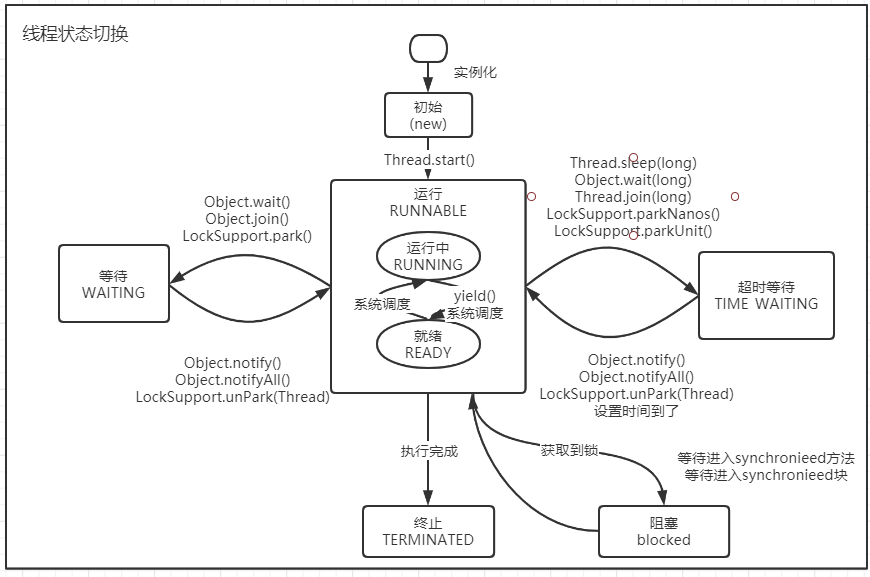

### 03线程的生命周期和状态

#### 六种状态

1. **NEW**

   初始状,线程被构建，但是还没有调用start（）方法。

2. **RUNNABLE**

   运行状态，Java线程将操作系统中的就绪和运行两种转台笼统的成为“运行中”。

3. **BLOCKED**

   阻塞状态，表示线程阻塞于锁

4. **WAITING**

   等待状态，表示线程进入等待状态，进入该状态表示当前线程需要等待其他线程做出一些特定动作（通知或中断）。

5. **TIME_WAITING**

   超时等待状态，该状态不同于WAITING，它是可以在指定的时间自行返回的。

6. **TERMINATED**

   终止装填，表示当前线程已经执行完毕。

#### 线程状态的切换

说明：

​	new Thread()之后线程就处于**new(新建)**的状态，调用Thread.start()方法后开始运行。线程这时候处于**ready（可运行）**状态，当CPU执行该线程时，线程状态为**running（运行中）**状态。

​	当线程执行wait（）方法之后，线程进入了**waiting（等待）**状态。进入等待状态的线程需要依靠其他线程的通知才能返回到运行状态，而**time_waiting(超时等待)**状态状态增加了超时限制，通过sleep（long），wait（long）方法可以将Java线程治愈**timed waiting**状态。当时间到达之后，线程返回到runnable状态。当线程调用同步方法时，在没有获取锁的情况下，线程将计入到**blocked（阻塞）**状态，线程执行完成Runnable的run（）方法后将会进入到**terminated（终止）**状态。

#### 上下文切换

​	一个CPU的和核心任意时刻只能被一个线程使用，为了让这些线程都能有效执行，CPU采取的策略是为了每个线程分配时间片并轮转的形式。当一个线程的时间片用完的时候就会重新处于就绪转台让给其他线程使用，这个过程就属于一次**上下文切换**。

​	当前任务执行完成CPU时间切片切换到另一个任务之前，会保存自己的状态，以便下次再切换回这个任务时，可以再加载这个任务的状态。**任务从保存到再加载的过程就是一次上下文切换**。

​	上下文切换对系统来说以为着消耗大量的CPU时间，事实上，可能是操作系统中时间消耗最大的操作。Linux相比其他操作系统,其上下文切换和模式切换的时间消耗非常少。