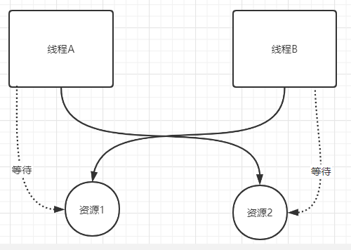

### 04线程死锁

#### 什么是线程的死锁

​	线程死锁: 多个线程同时被阻塞,其中的一个或多个等待某个资源被释放。由于线程被无限期地阻塞，因此程序不能正常终止。



​	线程A持有资源2,线程B持有资源1。现在线程A等待线程B释放资源1，线程B等待线程A释放资源2。这样A B两个线程相互等待而进入死锁的状态。

```java
public class DeadLockDemo {
    // 资源1
    private static final Object resource1 = new Object();
    // 资源2
    private static final Object resource2 = new Object();

    public static void main(String[] args) {
        new Thread(()->{
            synchronized (resource1) {
                System.out.println(Thread.currentThread()+"get resource1");

                try {
                    // 这里为了让下个线程启动,线程B就占用了资源。
                    Thread.sleep(1000);
                } catch (InterruptedException e) {
                    e.printStackTrace();
                }
                System.out.println(Thread.currentThread() + "waiting get resource2");

                synchronized (resource2) {
                    System.out.println(Thread.currentThread()+"get resource2");
                }
            }
        },"线程A").start();


        new Thread(()->{
            synchronized (resource2) {
                System.out.println(Thread.currentThread()+"get resource2");

                try {
                    Thread.sleep(1000);
                } catch (InterruptedException e) {
                    e.printStackTrace();
                }
                System.out.println(Thread.currentThread() + "waiting get resource1");

                synchronized (resource1) {
                    System.out.println(Thread.currentThread()+"get resource1");
                }
            }
        },"线程B").start();
    }
}
```

执行结果: 

```java
> Task :DeadLockDemo.main()
Thread[线程A,5,main]get resource1
Thread[线程B,5,main]get resource2
Thread[线程B,5,main]waiting get resource1
Thread[线程A,5,main]waiting get resource2
```

操作系统产生死锁的四个条件：

1. 互斥条件：该资源任意时刻只由一个线程占用。
2. 请求与保持条件：一个进程因请求资源而阻塞时，对已获取的资源保持不放。
3. 不剥夺条件：线程已获得的资源在末使用完之前不能被其他线程强行剥夺，只有自己使用完毕后才释放资源。
4. 循环等待条件：若干进程之间形成一种头尾相接的循环等待资源关系。

#### 如何避免线程死锁：

总的来说就是要破坏产生死锁的必要条件：

1. **企图破坏互斥条件**：但是线程之间加入锁机制，就是让线程之间形成互斥关系，避免逻辑错乱。
2. **破坏请求与保持条件**：一次性申请所有资源。
3. **破坏不剥夺条件**：占用资源1的线程A，申请资源2的时候，如果申请不到资源2，那就直接释放资源1。
4. **破坏循环等待条件**：靠按序申请来预防。按某一顺序申请资源，释放资源则反序释放。

修改上边的代码：

```java
  new Thread(()->{
            synchronized (resource1) {
                System.out.println(Thread.currentThread()+"get resource1");

                try {
                    Thread.sleep(1000);
                } catch (InterruptedException e) {
                    e.printStackTrace();
                }
                System.out.println(Thread.currentThread() + "waiting get resource2");

                synchronized (resource2) {
                    System.out.println(Thread.currentThread()+"get resource2");
                }
            }
        },"线程B").start();
```

​	线程A获取resource1再获取resource2，现在线程B获取resource1再获取resource2，现在线程A释放了resource1和resource2的占用，线程B获取到了就可以执行了。这样就破坏了循环等待的条件，因此避免了死锁。