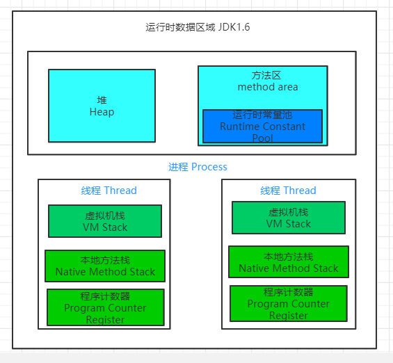

### 进程和线程

#### 什么是进程和线程

​	**进程**: 程序一次执行过程，是系统运行程序的基本单位。因此进程是动态的，系统运行一个程序即是一个进程从创建，运行到消亡的过程。在Java中用main函数，打印一个“hello world”其实启动了一个JVM的进程，而main函数所在的线程就是这个进程中一个线程，也称为主线程。

​	**线程：** 线程与进程相似，但是线程是一个比进程更小的执行单位。一个进程在其执行的过程可以产生多个线程。与进程不同的是同类的多个线程共享进程的**堆**和**方法区**资源；每个线程都有自己的**程序计数器**，**虚拟机栈**和**本地方法栈**。系统产生一个线程，或是再各个线程之间切换工作时，负担比进程小得多，线程也被称为轻量级进程。

#### 线程与进程的关系，区别以及优缺点

从JVM角度说进程和线程之间的关系

从上图可以看出：一个进程中可以有多个线程，多个线程共享进程的**堆**和**方法区**（JDK1.8之后是元空间）资源，但是每个线程都有自己独立的**程序计数器**，**虚拟机栈**和**本地方法栈**。

**总结：**线程是进程划分成为更新的运行单位，线程和进程最大的不同在于基本上哥哥进程是独立的，但是线程不一定，同一个进程中的线程可能相互影响。线程执行开销小但不利于资源的管理和保护；而进程相反。

延伸问题 :

为什么程序计数器、虚拟机栈和本地⽅法栈是线程私有的呢? 为什么 堆和⽅法区是线程共享的呢？

1. 程序技术器为什么是私有的？

   ​	程序计数器主要有下面两个作用：

   - 字节码解释器通过改变程序计数器来一次读取指令，从而实现代码的流程控制，比如：顺序执行，选择，循环，异常处理。
   - 在多线程的情况下，程序计数器用于记录当前线程执行的位置，从而当前线程切换回来的时候能够知道该线程上次运行到哪儿了。

   需要注意的是如果执行的是natice方法，那么程序计数器记录的是undefined地址，只有执行的是Java代码时程序计数器记录的才是下一跳指令的地址。

   所以程序技术器私有主要是为了线程切换后能恢复到正确的执行位置。

2.  虚拟机栈和本地⽅法栈为什么是私有的 ?

   - 虚拟机栈：每个Java方法执行的同时，会创建一个栈帧和用于存储局部变量表，操作数栈，常量池引用等信息。方法调用到结束，就栈帧在Java虚拟机栈中入栈和出栈的过程。
   - 本地方法栈：与虚拟机栈所发挥的作用非常相似，区别在于：虚拟机栈为虚拟机执⾏ Java ⽅法 （也就是字节码）服务，⽽本地⽅法栈则为虚拟机使⽤到的 Native ⽅法服务。

3. 简单了解一下堆和方法区

堆是要存放新建对象，方法区要存放类信息，常量，静态变量等，这些功能是针对整个JVM的，不是指定线程的。

