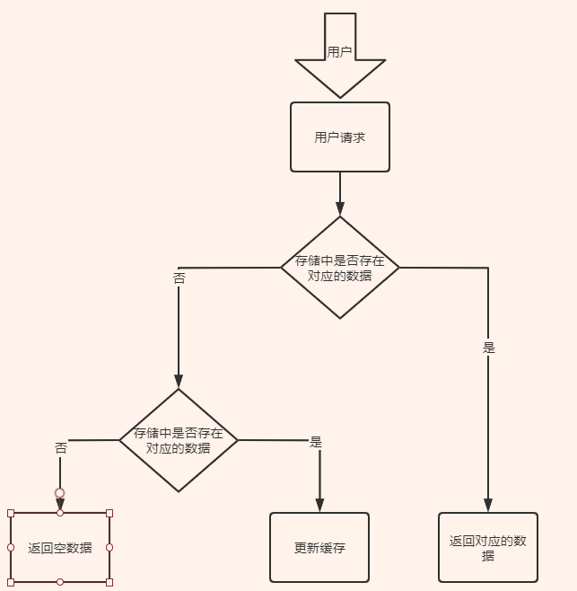

### Redis面试总结

#### 1. 简单介绍一下redis

- c语言开发的非关系型数据库
- 数据存储在内存中

##### 应用场景

- 作为缓存来使用
- 分布式锁
- 消息队列

##### redis的优点

- 多种数据类型支持不同业务场景
- Redis还支持事务
- 持久化
- Lua脚本
- 多种集群方案

####    2. 分布式缓存常见的技术选型方案有哪些 ?

主要是**Memcached**和**Redis**。基本没有见过Memcached来做缓存，基本都是Redis。

#### 3. Redis和Memcached的区别和共同点

##### 共同点：

- 都是基于内存的数据库，一般都是用来当做缓存使用。
- 都有过期策略
- 性能比较高

#####  区别 ：

- Redis支持**丰富的数据类型（支持丰富的应用场景）**。Redis支持简单的**k-v**，还提供了**list，set，zset，hash**数据结构的存储。Memcached只支持最简单的k/v数据类型。
- Redis支持数据的**持久化**，可以将内存中的数据保持在磁盘中，重启的时候可以再次加载使用，而Memecache把数据全部存在内存中。
- **Redis有灾难恢复机制**。因为Redis支持持久化。
- Redis在服务器内存使用完之后，可以**将不用的数据放到磁盘**上。但是Memcache在服务器内存使用完成之后就会直接报异常。
- memcached没有原生的集群模式,需要依靠客户端来实现往集群中分片写入数据。Redis ⽬前是原⽣⽀持 **cluster模式**的
- Memcached 是**多线程，⾮阻塞I/O复⽤的⽹络模型**；Redis 使⽤**单线程的多路I/O复⽤模型**（6.0Redis支持多线程）。
- Redis支持**发布订阅模型,Lua脚本,事务**等功能,而Memcached不支持这些。Redis支持更多的编程语言。
- memcached过期数据的删除策略只用到了**惰性删除** ，而Redis同时使用了**惰性删除与定期删除**。

注释：

cluster模式：集群模式，Redis支持主从模式，哨兵模式

惰性删除：取数据的时候对数据进行过期检查。这样对CPU比较友好，但是可能造成了大量的过期数据没有删除。

定期删除：每隔一段时间抽取一批key执行删除过期key操作。Redis底层会通过限制删除操作执⾏的时⻓和频率来减少删除操作对CPU时间的影响。

#### 缓存数据的处理流程是怎么样的 ？

- 如果用户请求的数据存在缓存中，直接返回。
- 缓存中不存在的话就看数据库中是否存在。
- 数据库中存储在的话就更新缓存中的数据。
- 数据库中不存在的话就返回空数据。

#### 5. 为啥要使用缓存（为什么要使用Redis）

为了提升用户体验以及应对更多的用户。

高性能：

​	用户第一次访问数据是从硬盘中读取的。如果用户访问的数据属于高频数据并且不会经常改变,那么将该用户数据存储在缓存中。下次访问的时候可以直接从缓存中获取了，相当于直接操作内存，速度会变快。注意：数据库和缓存中的数据的一致性问题。

高并发：

MySQL这类数据库的**QPS**大概是1w左右（4核8g），但是Redis很容易达到10w+，甚至是30w+（就单机而言，redis集群的话会更高）。直接操作缓存能够承受的数据库请求数量是远远大于直接访问数据库的。这样用户的一部分请求直接到了缓存中，不用直接打到数据库上，这样就提高了系统整体的并发。

