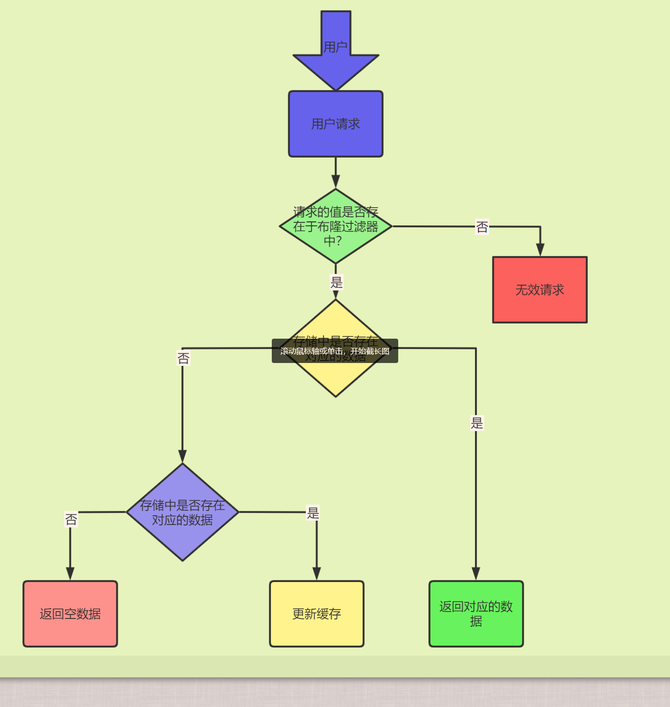

### Redis面试总结

#### 1. Redis数据结构以及使用场景分析

##### string

###### 简单动态字符串(SDS),可以保存文本数据,保存二进制数据。

###### 常用命令：

- set：设置值 
- get：获取
- strlen：获取长度
- exists ：判断key是不是有值
- decr：数字类型-1
- incr：数字类型+1
- setex：设置值的时候加上过期时间

###### 应用场景：

​	需要计数的场景，比如用户访问次数，热点文章点赞，转发数量。

##### list

###### list即是链表。是一个双向链表，支持反向查找和遍历更方便操作。

###### 常用命令：

rpush：从链表头插入

rpop：从链表头弹出

lpush：从链表尾插入

lpop：从链表尾弹出

lrange：按照下标进行遍历 0 -1可以遍历所有。

llen：求数组的长度

###### 应用场景：

发布订阅或者说消息队列，慢查询。

##### hash

###### 介绍: 

- 内部是实现:数组+链表
- key + value的映射表
- 适合存储对象，可以直接修改对象中某个字段的值

###### 常用命令：

hset：增加/修改

hmset: 批量的

hexists：判断是否存在

hget：获取数据

hgetall：获取所有的

hkeys：查看所有的keys

hvals：查看所有的值

###### 应用场景：

缓存对象数据的存储。

##### set

###### 介绍：

一种无序集合

不会出现重复数据

轻易实现交集，并集，差集的操作

###### 常用命令

sadd：增加数据

spop：删除

smembers：查看所有数据

sismember：查看元素是否存储在

scard：查看set的长度

sinterstore：求set的交集

sunion：求set的并集

###### 应用场景：

存储不重复的数据

多个数据源交集和并集

共同关注，共同粉丝，共同喜好

##### sorted set

###### 介绍

增加了权重参数score，进行有序排列

###### 常用命令：

zadd：增加元素

zcard：查看元素数量

zscore：查看某个元素的权重

zrange：顺序输出某个范围的元素

zrevrange：反转输出某个范围的元素

zrem：删除

###### 应用场景：

根据某个权重进行排序的场景

实时排行信息：礼物排行榜，弹幕消息

#### 2.Redis单线程模型详解

**Redis基于Reactor模式来设计开发了自己的一套高效的时间处理模型**。Redis中的文件事件处理器是单线程方式运行的，所以我们一般都说Redis是单线程模型。

##### 既然是单线程，那怎么监听大量的客户端连接呢？

IO多路复用程序监听来自客户端的大量连接（或者说是监听多个socket），它会将感兴趣的事件及类型（读，写）注册到内核中并监听每个事件是否发生。

**I/O多路复用技术的使用让Redis不需要额外的创建多余的线程来监听客户端的大量连接,降低了资源的消耗**(NIO中的Selector组件很像)

虽然文件事件处理器以单线程方式运行,但通过使用I/O多路复用程序来监听多个套接字,实现了高性能的网络通信模型。

**文件事件处理器：**

- 多个socket（客户端连接）
- IO多路复用程序（支持多个客户端连接的关键）
- 文件事件分派器（将socket关联到相应的时间处理器）
- 事件处理器（连接应答处理器，命令请求处理器，命令回复处理器）

#### 3. Redis没有使用多线程，为什么不适用多线程？

**Redis 在 4.0 之后的版本中就已经加⼊了对多线程 的⽀持。**

Redis4.0增加的多线程主要是针对一些大键值对的删除命令，使用这些命令就会使用主处理之外的其他线程来“异步处理”。Redis6.0之前主要还是单线程处理。

##### Redis6.0之前，为什么不适用多线程？

- 单线程编程容易并且更容易维护

- Redis的性能瓶颈不再CPU，主要在内存和网络

- 多线程就会存在死锁，线程上下文切换等问题，甚至会影响性能

  

#### 4. Redis6.0 之后为何引入了多线程？

引入多线程主要是为了提高网络IO读写性能。

redis6.0引入了多线程，但是多线程只是在网络数据的读写这类耗时操作上使用了，执行命令仍然是单线程顺序执行。

redis6.0的多线程默认是禁用的，只使用主线程。开启需要修改redis配置文件redis.conf。

```java
io-threads-do-reads yes
```

开启了多线程之后,还需要设置线程数,否则是不生效的。需要修改redis.conf

```java
io-threads 4  #官⽹建议4核的机器建议设置为2或3个线程，8核的建议设置为6个线程
```


#### 5. Redis给缓存数据设置过期时间有啥用?

内存是有限的,缓存数据一直保存的话,分分钟直接out of memory。

相关的命令：

- exp ： 设置过期时间
- setex ：字符串类型独有设置时间过期命令
- ttl：查看数据还有多久过期
- persist：移除一个键的过期时间

还可以用作短信验证码，1分钟自动过期。传统的数据库还需要自己进行判断，性能差很多。


#### 6. Redis是如何判断数据是否过期？

**过期字典**来保存数据过期时间，过期字典的健指向Redis数据库中某个key，过期字典的值是一个long long类型的整数，指责格整数保存了key所指向的数据库健的过期时间。

#### 7. 过期数据的删除策略了解么？

常用的过期数据删除策略：

- 惰性删除：取key值的时候，对数据进行过期检查。这样对CPU最友好，但是可能造成太多过期的key没有被删除。
- 定期删除：每隔一段时间，抽取一批key执行删除过期key操作。redis底层会通过限制删除操作执行的时长和频率来减少删除操作对CPU的影响。

redis采取了定期删除+惰性删除混合策略。但是还是可能造成大量的过期key没有被清理的情况，造成oom。通过内存淘汰机制来解决这个问题。

#### 8. Redis内存淘汰机制

- volatile-lru : 从已设置过期时间的数据集中挑选最近最少使用的数据淘汰。
- volatile-ttl：从已经设置过期时间的数据中挑选将要过期的数据淘汰。
- volatile-random：从已设置过期时间的数据集中任意选择数据淘汰。
- allkeys-lru：内存不足时，移除最近使用最少的key。
- allkeys-random：从数据集中任意选择数据淘汰。
- no-eviction：禁止删除数据，内存不足的时候写入新数据报错。

4.0版本后新增两种:

- volatile-lfu: 从已设置过期时间的数据集移除最不经常使用的数据淘汰。
- allkeys-lfu：当内存不足以容纳新写入数据时，在键空间中，移除最不经常使用的key


#### 9. Redis持久化机制

为了防止系统故障而将数据进行物理备份，需要将redis中的数据进行持久化。

快照（RDB）： 通过创建快照来获取存储在内存里的数据在某个时间点上的副本。对快照进行备份，将快照复制到其他服务器，从而创建具有相同数据的服务器副本，还可以将快照留在原地以便重启服务器的时候使用。

```java
save 900 1 #在900秒之后,如果至少有1个key发生变化,Redis就会自动触发BGSAVE命令创建快照
save 300 1 #在300秒之后,如果至少有10个key发生变化,Redis就会自动触发BGSAVE命令创建快照
save 60 10000    #在60秒(1分钟)之后，如果⾄少有10000个key发⽣变化，Redis就会⾃动触发BGSAVE命令创建快照。
```


只追加文件（AOF）：

```java
appendonly yes
```

每执行一条会更改Redis中数据的命令,Redis就会将该命令写入硬盘中的AOF文件。AOF文件的保存位置和RDB文件的位置相同，都是通过dir参数设置的，默认文件名是appendonly.aof。

```java
appendfsync always #每次有数据修改发生时都会写入AOF文件,这样会严重降低Redis的速度
appendfsync eversec #每一秒同步一次,显示地将多个写命令同步到硬盘
appendfsync no #让操作系统决定何时进行同步    
```

为了兼顾数据和写⼊性能，⽤户可以考虑 appendfsync everysec 选项,Redis性能几乎没受到任何影响,而且即使出现系统崩溃,数据最多只会丢失一秒内产生的数据。当硬盘忙于执行写入操作的时候，Redis还会优雅的放慢自己的速度以便适应硬盘的最大写入速度。

##### Redis 4.0 对于持久化机制的优化

Redis4.0可以支持RDB和AOF混合持久化

```java
aof-use-rdb-preamble
```

如果开启混合持久化的,AOF重写的时候就直接把RDB的内容写到了AOF文件开头。

**优点：**可以结合RDB和AOF的优点，快速加载同时避免丢失过多的数据。

**缺点**：AOF里边RDB部分是压缩格式，不是AOF格式，可读性比较差。

##### AOF重写

产生一个新的AOF文件，和原有的AOF问价所保存的数据库状态一样，但是体积更小。

重写过程 ：

- 通过读取数据库中的键值对来实现的，程序无须对现有AOF文件进行任何读入，分析和写入的操作。
- 在执行BGREWRITEAOF命令时，Redis服务器会维护一个AOF重写缓冲区，
- 该缓冲区会在子进程创建新AOF文件期间，记录服务器执行的所有写命令。
- 创建新的AOF文件工作之后，服务器会将重写缓存区中的所有内容追加到新的AOF文件末尾，使得新旧两个AOF文件所保存的数据库状态一致。
- 最后服务器用新的AOF文件替换旧的AOF文件，来完成AOF文件重写操作。

#### 10.  Redis事务

Redis可以通过MULTI, EXEC, DISCARD和WATCH等命令实现事务功能。

multi可以输入多个命令。Redis不会立即执行这些命令，而是将它们放到队列，当调用了exec命令将执行所有命令。

Redis是不支持roll back的，所以不满足原子性的（而且不满足持久性）。

Redis的事务：**提供了⼀种将多个命令请求打包的功能。然后， 再按顺序执⾏打包的所有命令，并且不会被中途打断。**

#### 11. 缓存穿透

##### 什么是缓存穿透？

大量的请求的数据库不存在缓存中，导致请求直接到了数据库上，基本上没有走过缓存这一层。

##### 如何处理缓存穿透？

做好参数校验，一些不合法的参数请求直接抛出异常信息返回给客户端。比如一些绝对值的判断null，0，还有一些格式的判断，电话号码，邮箱地址等。

将无效的key进行缓存，设置一定的过期时间。但是如果有大量不同的key，redis中缓存大量无效的key。不能从根本解决问题。

**布隆过滤器**：

非常方便地判断一个给定数据是否存在于海量数据中。

应用：把所有可能存在请求的值都存在布隆过滤器中，当用户请求过来，先判断用户发来的请求的值是否存在于布隆过滤器中，不存在的话，直接返回请参数错误信息给客户端，存在的话才会走下面的流程。



**布隆过滤器的特点**: 如果布隆过滤器说某个元素存在,小概率会误判,但是布隆过滤器说某个元素不存在,那么这个元素一定不再。（这个特点真的是完美解决缓存穿透的问题）！

**布隆过滤器的原理：**

当一个元素加入布隆过滤器中的时候，会进行哪些操作：

1. 使用布隆过滤器中哈希函数对元素值进行计算，得到哈希值
2. 根据得到的哈希值，在位数组中吧对应的下标值设置为1

当我们需要判断⼀个元素是否存在于布隆过滤器的时候，会进⾏哪些操作：

对给定元素再次进行相同的哈希计算

得到值之后判断位数组中额每个元素是否都为1，如果值都为1，那么说明指责格值在布隆过滤器中，如果存在一个值不为1，说明这个值不在布隆过滤器中。

**但是，不同的字符串可能哈希出来的位置相同。**（所以会出现布隆过滤器的特点）


#### 12.缓存雪崩

##### 什么是缓存雪崩？

1. 缓存在同一时间大面积的失效，后面的请求都直接落到了数据库上，造成数据库短时间承受大量请求。
2. 有一些被大量访问数据（热点缓存）在某一时刻大面积失效，导致对应的请求直接落到了数据库上。

##### 如何进行解决

针对 Redis 服务不可⽤的情况：

1. 采用Redis集群，避免单机出现问题整个缓存服务都没办法使用。
2. 限流，避免同时处理大量的请求。

针对热点缓存失效的情况：

1. 设置不同的失效时间比如随机设置缓存的失效时间。
2. 缓存永不失效


#### 13. 如何保证缓存和数据库数据的一致性

 **Cache Aside Pattern（旁路缓存模式）**

遇到写请求：更新DB，然后直接删除cache。

如果数据库更新成功，但是缓存删除失败的话的解决方案：

1. 缓存失效事假变短（不能根治问题）：过期时间变短，这样的话缓存就会从数据库中加载数据。
2. 增加cache更新重试机制：如果删除缓存失败的话，然后就设置隔一段时间进行重试。重试次数也可以自己定。如果达到重试次数任然不行的话，可以将key加入队列中，等缓存服务可用之后，再将缓存中对应的key删除即可。


