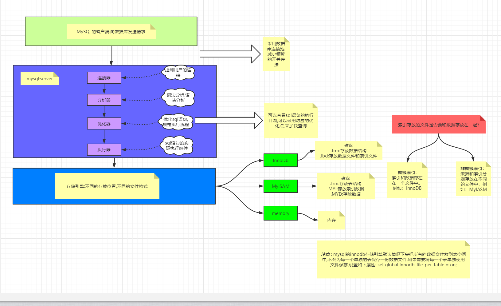
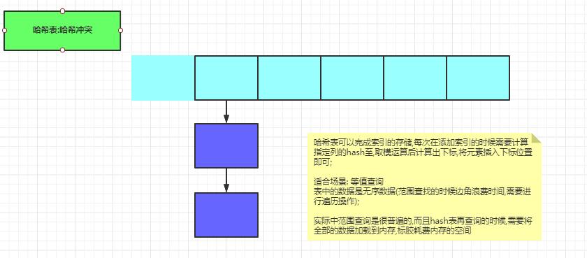
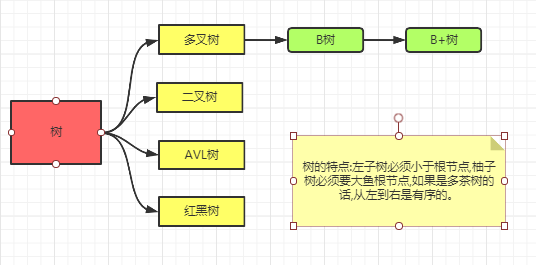
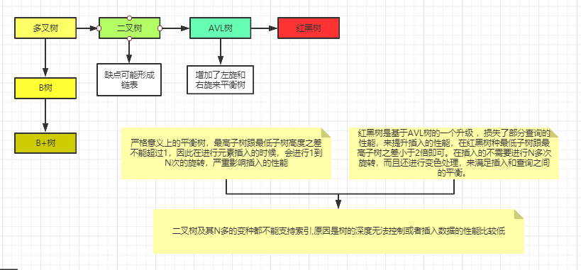
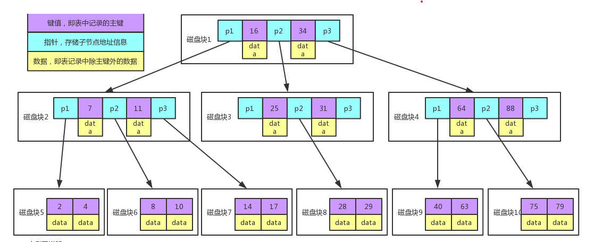
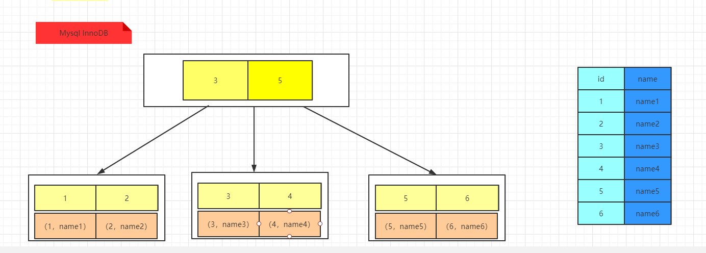
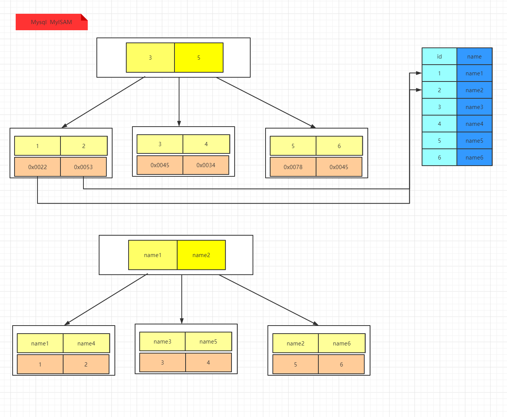
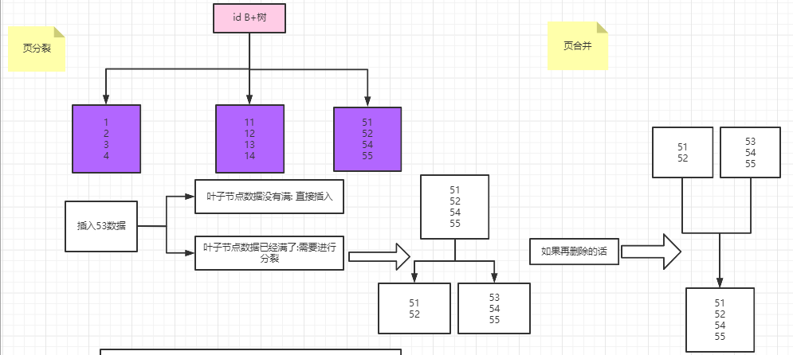
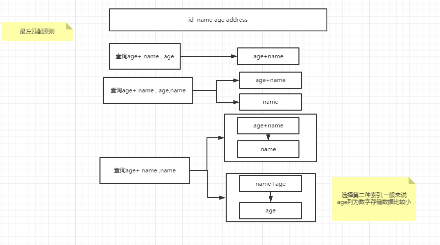
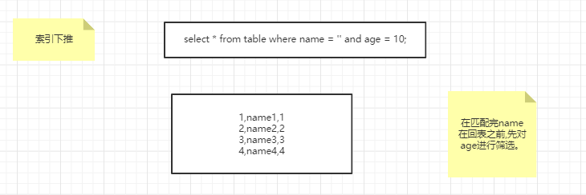

### MySQL索引

#### 基础知识储备

**局部性原理**：CPU访问存储器时，无论是存取指令还是存取数据，所访问的存储单元都趋于聚集在一个较小的连续区域中。

​	我们希望CPU用的数据尽可能的离CPU更近（寄存器->L1->L2->L3->内存->磁盘），所以当CPU用到一个数据的时候,计算机会遇见性的将这个数据放到L1,L2,L3内存中。用到的可能性越大，就能存到越接近寄存器的层次。

​	时间局部性：如果一个信息正在被使用，那么近期这个信息还可能被再次使用。

​	空间局部性：在最近的将来将要被用到的信息很有可能与现在使用的信息在空间地址上是临近的，正在使用的的这个数据的地址旁边的数据，当然也可能被用到，比如数组什么的。

**磁盘预读**：磁盘读写并不是按需读取，而是按页预读，一次会读一页的数据，每次加载更多的数据，如果未来要读取的数据就在这一页中，可以避免未来的磁盘IO，提高效率；
*画外音：通常，一页数据是4K。*

#### 什么是索引

帮助Mysql高效获取数据的数据结构

#### 索引存储位置

索引存储在文件系统中

索引的文件存储形式与存储引擎有关

#### MySql的索引的选择

##### 选择hash表

哈希表可以完成索引的存储,每次在添加索引的时候需要计算指定列的hash至,取模运算后计算出下标,将元素插入下标位置即可;

适合场景: 等值查询

hash表存在的缺点:

1. 利用hash存储需要将数据加载到内存中,数据量大的话消耗太多的内存。
2. 如果是等值查询比较快；但是如果是范围查询的话，索引通过计算分布在数组的不同的下标下，范围查询对于hash表就比较复杂了。

##### 选择树

树结构的进化过程

二叉树：

​	不论是二叉树还是红黑树，都会因为数据上升会导致树的深度过深，造成查询的时候IO操作次数太多，影响读取的效率。

B树：

B树的特点：

- 所有的健值都分布在整棵树中
- 搜索有可能在非叶子节点结束，在关键字内做一次查找，性能逼近二分查找
- 每个节点最多拥有m个子树
- 根节点至少有2个子树
- 分支节点至少拥有m/2颗子树（除了根节点和叶子节点外都是分支节点）
- 所有叶子节点都在同一层，每个节点最多可以有m-1个key，并且升序排列

例图说明:

1. 每个点相当于一个磁盘块
2. 一个节点有两个升序排序的关键字和三个指向子树根节点的指针,指针存储的是子节点所在磁盘的地址
3. 两个关键字分成三个范围域对应三个指针指向的子树的数据的范围域,以根节点为例：key为16和34，P1指针指向子树的数据范围小于16，P2指针指向的子树的数据范围为16 - 34，P3指针指向子树的数据范围为大于34

查找key的过程：

1. 根据根节点找到磁盘块1，读入内存。【磁盘IO操作第1次】
2. 比较关键字28在区间（16,34），找到磁盘块1的指针P2。
3. 根据P2指针找到磁盘块3，读入内存。【磁盘IO操作第2次】
4. 比较key28在区间（25,31），找到磁盘块3的指针P2。
5. 根据P2指针找到磁盘块8，读入内存。【磁盘IO操作第3次】
6. 在磁盘块8中key中找到对应的key28。

B树存在缺点：

1. 每个节点都有key和data，但是每个页存储空间时有限的，如果data比较大会导致每个节点存储的key数量变小
2. 当存储的数据量很大的时候会导致深度比较大，增大查询磁盘IO的次数，进而影响查询的性能

##### mysql的最终答案 - B+树

B+树是在B树的基础上做的一种优化,优化如下:

1. B+树每个节点可以包含更多的节点,这这样做的原因是: 1,为了降低树的高度;2,将数据范围变为多个区间,区间越多,数据检索越快。
2. 非叶子节点存储key，叶子节点存储key和data（数据）；
3. 叶子节点两两指针相互连接（符合磁盘的预读性特性），顺序查询性能更高。

**注意点**：

1. 在B+树上有两个头指针,一个指向根节点,另一个指向关键字最小的叶子节点。
2. 所有叶子节点之间是一种链式环结构。

因此可以对B+Tree进行**两种查找运算**：一种是对于主键的范围查找和分页查找，另一种是从根节点开始，进行随机查找。

#### mysql索引

mysql InnoDB -- B+Tree，叶子节点直接放置数据

**注意：**

1. InnoDB是通过B+树结构对主键创建索引，然后叶子节点中存储记录，如果没有主键，name会选择唯一健，如果没有唯一健，那么会生成一个6位的rowId来作为主键。
2. 如果创建索引是其他字段，那么叶子节点中村的是该记录的主键，然后再通过主键索引找到对应的记录 ，这个就是**回表**。

mysql MysISAM -- B+树

#### 索引分类

主键索引,唯一索引,普通索引和全文索引,组合索引。

##### 主键索引：

​	主键是一种唯一性索引，必须制定为primary key，每个表只有一个。

​	自增id如何实现？ -> 自增锁来维护来实现。

​	设置自增，防止页分裂。

##### 唯一索引

​	索引列的值只能出现一次，必须唯一，但是可以为空。

##### 普通索引

​	基本的索引类型，值可以为空，没有唯一性的限制。（覆盖索引：select 主键的时候,减少回表的操作。）

##### 全文索引 MyISAM支持，InnoDB在5.6之后支持

​	索引类型为FULLTEXT。全文索引可以在varchar，char，text类型的列上设置。但是实际中基本不用数据库做全文搜索，需要ELK等技术。

##### 组合索引

​	多列值组合成一个索引，专门用于组合搜索。

​	最左匹配原则，最左匹配原则。 

##### 索引下推

​	谓词下推(predicate push down ):SQL语句中的部分语句( predicates 谓词部分) 可以被 “pushed” 下推到数据源或者靠近数据源的部分.通过尽早过滤掉数据，这种优化可以大大减少查询/处理时间。

#### Mysql存储引擎

|              | MyISAM       | InnoDB                     |
| ------------ | ------------ | -------------------------- |
| 索引类型     | 非聚簇索引   | 聚簇索引                   |
| 支持事务     | 否           | 是                         |
| 支持表锁     | 是           | 是                         |
| 支持行锁     | 否           | 是                         |
| 支持外键     | 否           | 是                         |
| 支持全文索引 | 是           | 是(5.6后支持)              |
| 适合操作类型 | 大量的select | 大量的insert,delete,update |

#### 索引维护

索引在插入新值的时候,为了维护索引的有序性,必须要维护。

1. 插入一个比较大的值，直接插入即可，机会没有成本。
2. 如果插入的是中间的某个值,需要逻辑上移动后续的元素,空出位置。
3. 人员故意太插入语的数据页满了就需要单独申请一个新的数据页，然后移动部分数据过去，叫做页分裂，此时性能会受空间的使用率的也会降低，除了页分裂之外还包含页合并。(画图解释放到了索引分类的主键索引上)

**所以要尽量使用自增主键作为索引。**