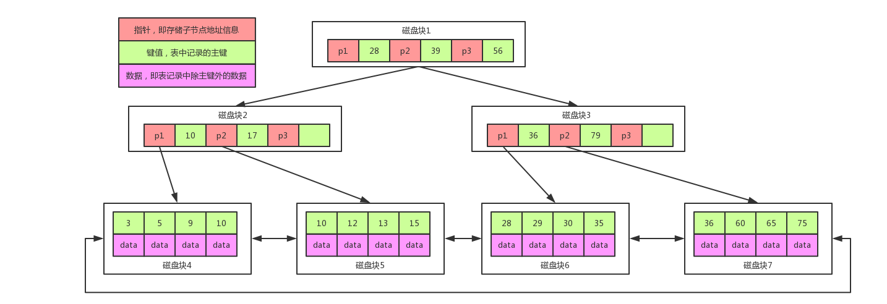

### MySQL索引

#### 基础知识储备

局部性原理

磁盘预读

#### 什么是索引

帮助Mysql高效获取数据的数据结构

#### 索引存储位置

索引存储在文件系统中

索引的文件存储形式与存储引擎有关

#### MySql的索引的选择

##### 选择hash表

hash表存在的缺点:

1. 利用hash存储需要将数据加载到内存中,数据量大的话消耗太多的内存。
2. 如果是等值查询比较快；但是如果是范围查询的话，索引通过计算分布在数组的不同的下标下，范围查询对于hash表就比较复杂了。

##### 选择树

二叉树：

​	不论是二叉树还是红黑树，都会因为数据上升会导致树的深度过深，造成查询的时候IO操作次数太多，影响读取的效率。

B树：

B树的特点：

- 所有的健值都分布在整棵树中
- 搜索有可能在非叶子节点结束，在关键字内做一次查找，性能逼近二分查找
- 每个节点最多拥有m个子树
- 根节点至少有2个子树
- 分支节点至少拥有m/2颗子树（除了根节点和叶子节点外都是分支节点）
- 所有叶子节点都在同一层，每个节点最多可以有m-1个key，并且升序排列

例图说明:

1. 每个点相当于一个磁盘块
2. 一个节点有两个升序排序的关键字和三个指向子树根节点的指针,指针存储的是子节点所在磁盘的地址
3. 两个关键字分成三个范围域对应三个指针指向的子树的数据的范围域,以根节点为例：key为16和34，P1指针指向子树的数据范围小于16，P2指针指向的子树的数据范围为16 - 34，P3指针指向子树的数据范围为大于34

查找key的过程：

1. 根据根节点找到磁盘块1，读入内存。【磁盘IO操作第1次】
2. 比较关键字28在区间（16,34），找到磁盘块1的指针P2。
3. 根据P2指针找到磁盘块3，读入内存。【磁盘IO操作第2次】
4. 比较key28在区间（25,31），找到磁盘块3的指针P2。
5. 根据P2指针找到磁盘块8，读入内存。【磁盘IO操作第3次】
6. 在磁盘块8中key中找到对应的key28。

B树存在缺点：

1. 每个节点都有key和data，但是每个页存储空间时有限的，如果data比较大会导致每个节点存储的key数量变小
2. 当存储的数据量很大的时候会导致深度比较大，增大查询磁盘IO的次数，进而影响查询的性能

##### mysql的最终答案 - B+树

B+树是在B树的基础上做的一种优化,优化如下:

1. B+树每个节点可以包含更多的节点,这这样做的原因是: 1,为了降低树的高度;2,将数据范围变为多个区间,区间越多,数据检索越快。
2. 非叶子节点存储key，叶子节点存储key和data（数据）；
3. 叶子节点两两指针相互连接（符合磁盘的预读性特性），顺序查询性能更高。

**注意点**：

1. 在B+树上有两个头指针,一个指向根节点,另一个指向关键字最小的叶子节点。
2. 所有叶子节点之间是一种链式环结构。

因此可以对B+Tree进行**两种查找运算**：一种是对于主键的范围查找和分页查找，另一种是从根节点开始，进行随机查找。

#### mysql索引

mysql InnoDB -- B+Tree，叶子节点直接放置数据

**注意：**

1. InnoDB是通过B+树结构对主键创建索引，然后叶子节点中存储记录，如果没有主键，name会选择唯一健，如果没有唯一健，那么会生成一个6位的rowId来作为主键。
2. 如果创建索引是其他字段，那么叶子节点中村的是该记录的主键，然后再通过主键索引找到对应的记录 ，这个就是**回表**。

mysql MysISAM -- B+树

