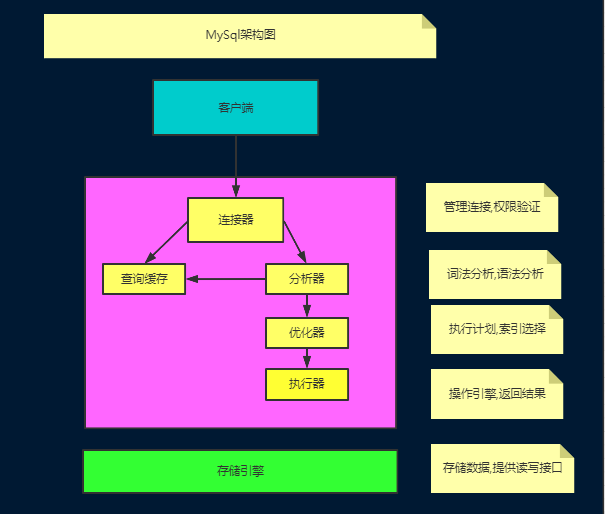
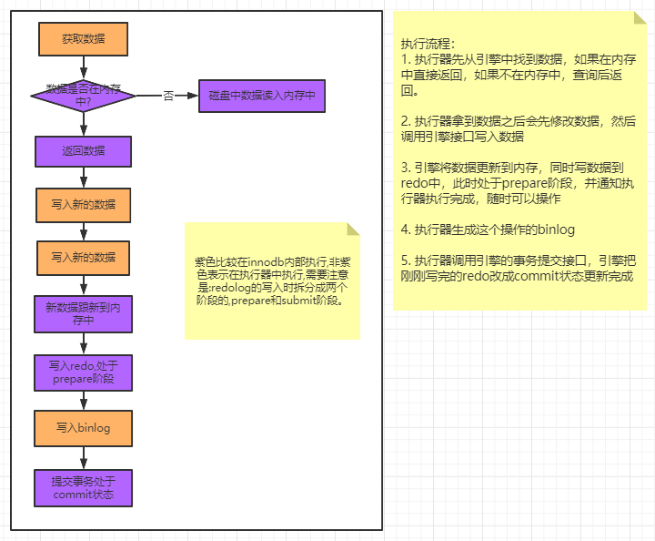

### 06Mysql的架构和日志

#### Mysql的架构

##### 连接器:

负责与客户端建立连接,获取权限,维持和管理连接

- 用户密码验证
- 查询权限信息,分配对应的权限
- 可以使用show processlist查看现在连接
- 如果太长时间没有动静,就会自动断开,通过wait_timeout控制,默认8小时

连接可以为两类:

- 长连接: 推荐使用的,但是要有周期性的断开长连接
- 短连接: 测试JDBC的时候，查询一次获取连接，执行完成sql之后关闭连接。

##### 查询缓存:

​	通过sql语句和结果作为一种key-value的形式存储在缓存中,执行语句的时候,先去查找缓存中的结果,如果找不到就继续之后后续的阶段。

​	但是，不推荐使用查询缓存：

1. 查询缓存失效比较频繁，只要表更新，缓存就会清空
2. 缓存对应更新的数据命中率比较低

**MySQL8.0之后不支持该组件了**

##### 分析器：

词法分析：MySQL需要把输入的字符串进行识别每个部分代表什么意思。

例如：

- 把字符串T 识别为表名T
- 把字符串ID识别为列名ID

语法分析：判断这个sql语句是否满足mysql的语法，如果不符合就会报错“You have an error in your SQL synta”

##### 优化器

在具体执行SQL语句之前，要先经过优化器的处理

- 当表中有多个索引的时候，决定用哪个索引
- 当sql语句需要做多表关联的时候，决定表的连接顺序

不同的执行方式对SQL语句的执行效率影响很大

- RBO:基于规则的优化
- CBO:基于成本的优化

##### 执行器

当选择了执行方案后，mysql就准备开始执行了，首先执行前会校验该用户有没有权限，如果没有权限，就会返回错误信息，如果有权限，就会去调用引擎的接口，返回接口执行的结果。

#### Mysql的日志

#####　redolog

当发生数据修改的时候,innodb殷勤会先将记录写到redo log中,并更新内存,此时更新完成,同时innodb引擎会在何时的时机将记录操作到磁盘中。

redo log是固定大小的，是循环写的过程

有了redo log之后，innodb就可以保证即使数据库发生异常重启，之前的记录也不会丢失（数据记录到redo log之中），叫做crash-safe。

图例：

例子：酒店记账本的例子：小黑板做临时记账 ，记账本记录实际的例子。

WAL（write ahead log）：预写日志

#####　undolog

实现原子性，Innodb还用undo log来实现多版本并发控制（MVCC）；

在操作数据之前，将数据备份到一个地方（这个存储数据备份的地方称为undo log），然后进行数据修改。如果出现错误或者用户执行了rollback语句，系统可以利用undo log中备份将数据恢复到事务开始之前。

**注意** undo log是逻辑日志，可以理解为：

- 当delete一条记录时候,undo log中会记录一条对应的insert记录
- 当insert一条记录时,undo log中会记录一条对应的delete记录
- 当update一条记录时,它记录一条对应的相反的update记录

##### binlog - 服务端的日志文件

binlog是mysql server层的日志，主要做mysql功能层面的事情。

与redo log日志区别：

- redo是innodb独有，binlog是多有引擎都可以使用；
- redo是物理日志，记录某个数据页上做了什么修改，binlog是逻辑日志记录的是这个语句的原始逻辑
- redo是循环写的，空间会用完，binlog是可以追加写的，不会覆盖之前的日志信息。

binlog中惠济路所有的逻辑，并且采用追加写的方式

一般在企业中数据库会有备份系统，可以定期执行备份，备份的周期可以自己设置

恢复数据的过程：

- 找到最近一次的全量备份数据

- 从备份的时间点开始，将备份的binlog取出来，重放到要恢复的那个时刻。

#### 数据更新的流程

#### redo log为何是两阶段提交

反证redo log的两阶段提交：

- 先写redo log后写bin log: 

    假设在redo log写完，binlog还没有写完的时候，MySQL进程异常重启。由于我们前面说过的，redo log写完之后，系统即使崩溃，仍然能够把数据恢复回来，所以恢复后这一行c的值是1。但是由于binlog没写完就crash了，这时候binlog里面就没有记录这个语句。因此，之后备份日志的时候，存起来的binlog里面就没有这条语句。然后你会发现，如果需要用这个binlog来恢复临时库的话，由于这个语句的binlog丢失，这

  个临时库就会少了这一次更新，恢复出来的这一行c的值就是0，与原库的值不同。

- 先写bin log 后写redo log"

  如果在binlog写完之后crash，由于redo log还没写，崩溃恢复以后这个事务无效，所以这一行c的值是0。但是binlog里面已经记录了“把c从0改成1”这个日志。所以，在之后用binlog来恢复的时候就多了一个事务出来，恢复出来的这一行c的值就是1，与原库的值不同。

