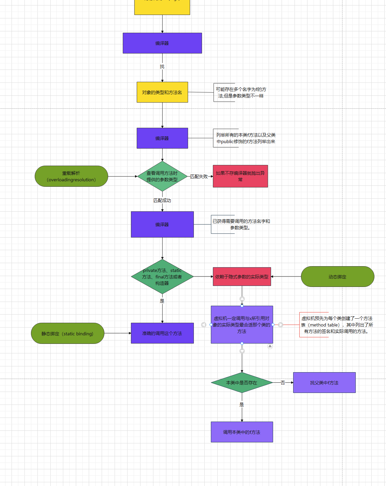

### 第五章 继承

**继承**已存在的类就是复用（继承）这些类的方法和域。

**反射**是指在程序运行期间发现更多的类及其属性的能力。

#### 5.1 类、超类和子类

##### 5.1.1 定义子类

extends表示继承。

##### 5.1.2 覆盖方法

新的方法来覆盖（override）超类中的方法。

子类的方法不能够直接地访问超类的私有域。

在子类中可以增加域、增加方法或覆盖超类的方法，然而绝对不能删除继承的任何域和方法。

##### 5.1.3 子类构造器

super关键字也有两个用途：一是调用超类的方法，二是调用超类的构造器。

一个对象变量（例如，变量e）可以指示**多种实际类型**的现象被称为**多态（polymorphism）**。在运行时能够自动地选择调用哪个方法的现象称为**动态绑定（dynamic binding）**。

##### 5.1.4 继承层次

由一个公共超类派生出来的所有类的集合被称为**继承层次（inheritance hierarchy）**。

Java不支持多继承。有关Java中多继承功能的实现方式，通过接口来实现的。

##### 5.1.5 多态

“is-a”规则，用来判断是否应该设计为继承关系的简单规则。

置换法则，它表明程序中出现超类对象的任何地方都可以用子类对象置换。

##### 5.1.6 理解方法调用

对象上应用方法调用

