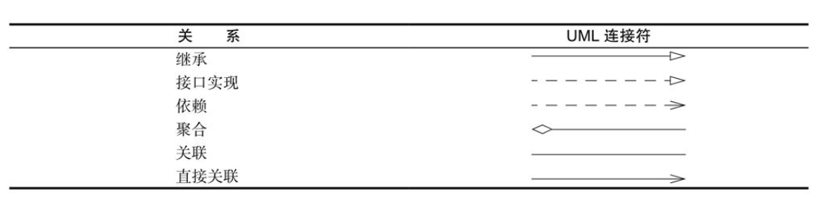

### 第四章: 对象与类

本章主要内容:

- 面向对象程序设计
- 如何创建标准Java类库中的类对象
- 如何编写自己的类

面向对象程序设计与面向过程程序设计在思维方式上存在着很大的差别。

**面向过程**: 以事件为中心,编程的时候将解决问题的步骤分析出来,然后用程序一步步的实现。然后再一步步的调用程序。

**面向对象**：编程的时候将面向过程一步步的实现的步骤利用封装，继承，多态实现一种模块化，降低耦合，易于扩展的编程思想。

#### 面向对象程序设计概述

Java是完全面向对象的

面向对象的程序是由对象组成的，每个对象包含对用户公开的特定功能部分和隐藏的实现部分。

传统的程序设计：首先要确定如何操作数据，然后再决定如何组织数据，以便于数据操作。而OOP却调换了这个次序，将数据放在第一位，然后再考虑操作数据的算法。

##### 类

类（class）是构造对象的模板。

由类构造（construct）对象的过程称为创建类的实例（instance）。

**封装**：将数据和行为组合在一个包中，并对对象的使用者隐藏了数据的实现方式。

**实例域（instance field）**：对象中的数据

**方法（method）**：操纵数据的过程

**封装的关键**在于绝对不能让类中的方法直接地访问其他类的实例域。

程序仅通过对象的方法与对象数据进行交互。

封装给对象赋予了**“黑盒”**特征，这是提高重用性和可靠性的关键。

**继承（inheritance）**：可以通过扩展一个类来建立另外一个新的类。

Java中，所有的类都源自于一个“神通广大的超类”，它就是**Object**。

扩展之后，新类具有老类的全部属性和方法。在新类中，只要提供适合这个新类的属性和方法即可。

##### 对象

三个主要特征:

- 对象的行为: 可以对对象施加那些操作。
- 对象的状态：当施加操作之后，对象如何响应。
- 对象标识：如何辨别具有相同的行为与状态的不同对象。

##### 识别类

oop设计首先从设计类开始,然后再往每个类上添加方法。

oop设计的经验：分析问题的过程中寻找名词，而方法对应着动词。

##### 类之间的关系

- 依赖（“uses-a”）
- 聚合（“has-a”）
- 继承（“is-a”）




#### 使用预定义类

Java中预定义的类。

##### 对象与对象变量

**构造器**是一种特殊的方法，用来构造并初始化对象。

在对象与对象变量之间存在着一个重要的区别：一个对象变量并没有实际包含一个对象，而仅仅引用一个对象。

局部变量不会自动地初始化为null，而必须通过调用new或将它们设置为null进行初始化。

##### Java类库中的LocalDate类

类库设计者决定将保存时间与给时间点命名分开。所以标准Java类库分别包含了两个类：一个是用来表示时间点的**Date**类；另一个是用来表示大家熟悉的日历表示法的**LocalDate**类。

不要使用构造器来构造LocalDate类的对象。实际上，应当使用**静态工厂方法**（factory method）代表你调用构造器。

```java
LocalDate.now()
```

**plusDays**方法会得到一个新的LocalDate

##### 更改器方法与访问器方法

plusDays方法会生成一个新的LocalDate对象。

只访问对象而不修改对象的方法有时称为**访问器方法**。

打印一个日历表，当前日期使用“*”作为标识：

```java
// 调用没有抛出异常
        ApiResult apiResult = ewModelService.getModelInfo("ab967295738640f1aaf7832e34786808");
        log.info(apiResult.toString());
    }


    @Test
    public void test_printData(){
        LocalDate date = LocalDate.now();
        // 获取当月
        int month = date.getMonthValue();
        // 获取今日
        int today = date.getDayOfMonth();
        // 这个得到本月开始日期
        date = date.minusDays(today - 1);

        DayOfWeek weekDay = date.getDayOfWeek();
        int value = weekDay.getValue();
        // 打印表头
        System.out.println("Mon Tue Wed Thu Fri Sat Sun");
        // 开头日期的空出来
        for (int i = 0; i < value; i++) {
            System.out.print("  ");
        }
        // 循环打印日期
        while (date.getMonthValue() == month) {
            System.out.printf("%3d",date.getDayOfMonth());

            if (date.getDayOfMonth() == today) {
                System.out.print("*");
            } else  {
                System.out.print(" ");
            }
            date = date.plusDays(1);
            if (date.getDayOfWeek().getValue() == 1) System.out.println();
        }
        if (date.getDayOfWeek().getValue() != 1) System.out.println();
    }
```

LocalDate的API:

 LocalTime now()

LocalTime of(int year, int month, int day)

getYear()

getMonthValue()

getDayOfMonth()

getDayOfWeek()

plusDays(int n)

 minusDays(int n): 1的时候这个月的第一天

#### 用户自定义类

##### Employee类

```java
/**
 * @ClassName Employee
 * @Description  Employee
 * @Author zhy
 * @Date 2021/3/10 9:38
 * @Version 1.0.0
 **/
public class Employee {
    // 实例字段
    private String name;

    private double salary;

    private LocalDate hirDate;

    // 构造函数
    public  Employee(String name,double salary, int year,int month,int day){
        this.name = name;
        this.salary = salary;
        this.hirDate = LocalDate.of(year,month,day);
    }

    // 方法
    public String getName() {
        return this.name;
    }
}
```

##### 多个源文件的使用

javac Employee*.java

#####  剖析Employee类

可以用public标记实例域，但这是一种**极为不提倡**的做法。public数据域允许程序中的任何方法对其进行读取和修改。

##### 从构造器开始

构造器会运行，以便将实例域初始化为所希望的状态。

构造器总是伴随着**new操作符**的执行被调用，而不能对一个已经存在的对象调用构造器来达到重新设置实例域的目的。

记住以下几点: 

- 构造器与类同名
- 每个类可以有一个以上的构造器
- 构造器可以有0个、1个或多个参数
- 构造器没有返回值
- 构造器总是伴随着new操作一起调用

**注意:**

- 不要在构造器中定义与实例域重名的局部变量。

##### 隐式参数与显式参数

关键字this表示隐式参数

显式参数:调用方法时明确要传递参数

##### 封装的优点

应该提供:

- 一个私有的数据域
- 一个公有的域访问器方法
- 一个公有的域更改器方法

如果需要返回一个可变数据域的拷贝，就应该使用clone。


##### final实例域

必须确保在每一个构造器执行之后，这个域的值被设置，并且在后面的操作中，不能够再对它进行修改。

##### 静态域

静态域nextId也存在。它属于类，而不属于任何独立的对象。

#####  静态常量

由于每个类对象都可以对公有域进行修改，所以，最好不要将域设计为public。然而，**公有常量（即final域）却没问题。**

##### 静态方法

静态服务: 没有隐式的参数。

使用类名，而不是对象来调用静态方法。

两种情况下使用静态方法：

- 一个方法不需要访问对象状态，其所需参数都是通过显式参数提供（例如：Math.pow）。
- 一个方法只需要访问类的静态域（例如：Employee.getNextId）。

##### 工厂方法

NumberFormat类不利用构造器完成这些操作呢？

- 无法命名构造器。构造器的名字必须与类名相同。但是，这里希望将得到的货币实例和百分比实例采用不用的名字。
- 当使用构造器时，无法改变所构造的对象类型。而Factory方法将返回一个DecimalFormat类对象，这是NumberFormat的子类

##### main方法

main方法也是一个静态方法。

静态的main方法将执行并创建程序所需要的对象。

#### 方法参数


